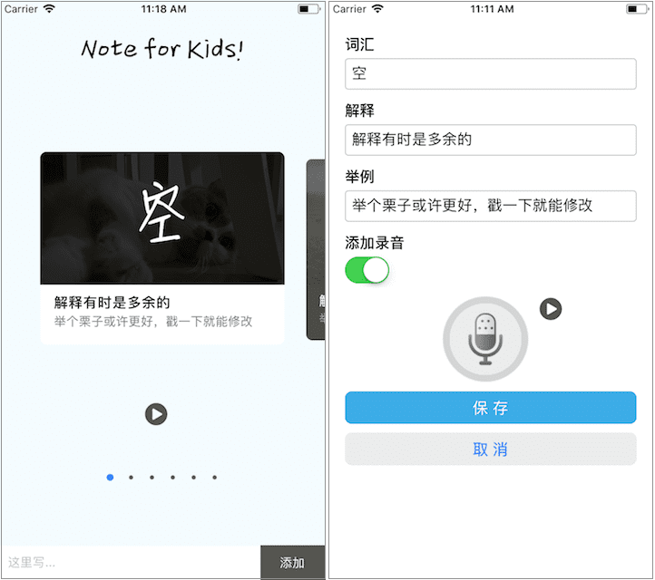

A simple chinese character note for primary school kids
------------------------

@2018/04/22

This is a two screen RNA aiming to provide extremely simple note-taking funcitonality for user. The original idea for this app was to create a tool for my son, to record the chinese HanZi(vacabulary) and to learn the Hanzi structure. So, each card has one big Hanzi or two to remember, coupling with the literal explanition as well as audio record(10 seconds long).


### To run this app:

```
$ npm install
$ react-native link
$ react-native run-ios
```


### Screenshot




### v1.0 release

@2018/06/13

* vacabulary entry add/update/delete exceeding 12
* user voice record/play with each card
* swipe browsing cards


### TODO

instead using the react-native-canvas module, develop a new module to use in this app.
